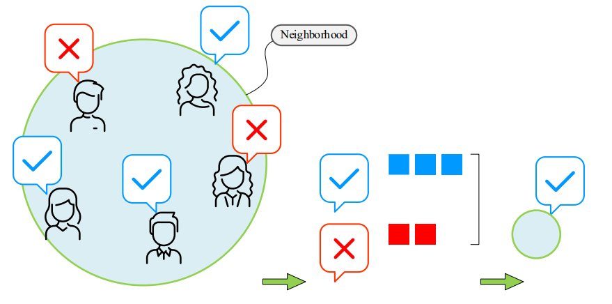

# K近邻分类(k-nearest neighbors, KNN)

## 原理

### 核心思想

**小范围投票，少数服从多数（majority voting）**

### 算法流程

给定样本数据$X(x^{(1)},x^{(2)},...,x^{(n)})$ ，分别对应标签$y(y^{(1)},y{(2)},...,y^{(n)})$,**查询点**(query point，即要分类的点)标签未知，待预测分类。
KNN算法流程如下：

1. 计算样本数据$X$任意一点$x$和查询点$q$的距离；
2. 找$X$中距离查询点$q$最近的$k$个样本，即k个“近邻”；
3. 根据k个近邻的已知标签，<u>直接投票或加权投票</u>,k个邻居中出现最多的标签即为查询点的分类。

### 公式表示

$$
\widehat{y}(q) = \underset{C_k}{\argmax} \underset{i \in kNN(q)}{\sum}I(y^{(i)}=C_k)
$$

其中，$kNN(q)$是$q$近邻构成的集合，$C_k$为标签，$I$为指示函数

## 近邻数量$k$的影响

显而易见的，k的大小会影响的投票的结果。
**如果选取较小的k，能够比较准确地捕捉训练数据的分类模式；但更易受噪声影响（如果$q$在噪声附近，就会和噪声标签相同）。**
**如果选取较大的k，能够比较好地抵抗噪声；但会使决策边界变得不明显，使得模型过于简化（考虑k=n时，任意$q$的标签都会是个数最多的那一种标签）。**

## 投票权重

之前考虑等权重投票，如果采取加权投票，则公式变为：

$$
\widehat{y}(q) = \underset{C_k}{\argmax} \underset{i \in kNN(q)}{\sum}w_i \cdot I(y^{(i)}=C_k)
$$

若权重为归一化后的距离，则

$$
w_i = \frac{max(d_{NN})-d_i}{max(d_{NN})-min(d_{NN})}
$$

