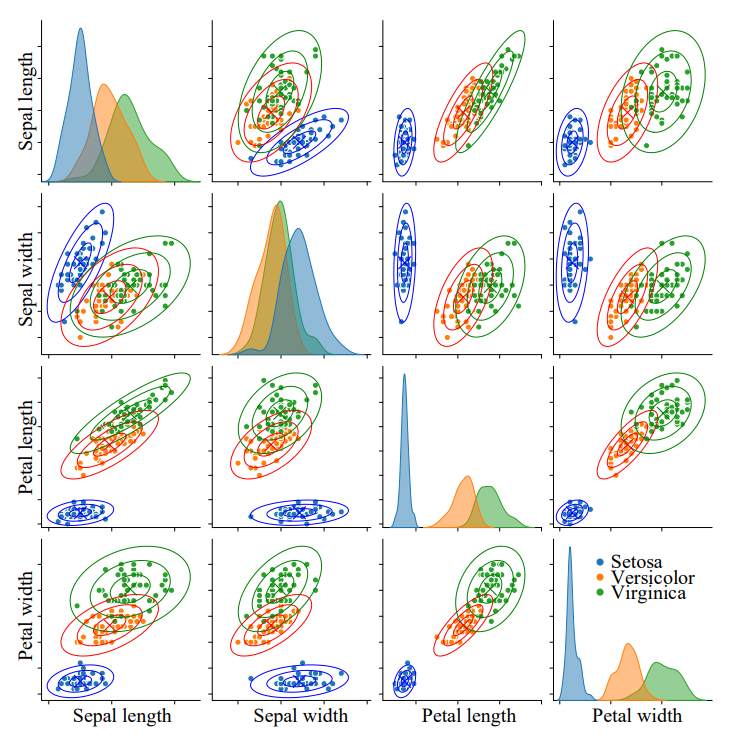

# 马氏距离

## 定义

**[马氏距离](metrics.md)，马哈距离 (Mahalanobis distance, Mahal distance)**，全称**马哈拉诺比斯距离**。

$$
d(x,\mu)=\sqrt{(x-\mu)^T\mathit{\Sigma}^{-1}(x-\mu)}
$$

其中，由于：

$$
\mathit{\Sigma=V\Lambda V^{-1}}
$$

其中，由于$\mathit{\Sigma}$为对称矩阵，$\mathit{V}$为正交矩阵，故可作特征值分解:

$$
\mathit{\Sigma^{-1}=V\Lambda^{-1} V^T}
$$

代入原式有：

$$
d(x,\mu)=\sqrt{[\mathit{\Lambda^{-1/2}V^T(x-\mu)}]^T[\mathit{\Lambda^{-1/2}V^T(x-\mu)}]}=\left \|\mathit{\Lambda^{-1/2}V^T(x-\mu)}\right\|
$$

其中,$\mu$列向量完成中心化 (centralize),$V$矩阵完成旋转 (rotate),$Λ$矩阵完成缩放 (scale)。

## 意义

马氏距离相当于对欧氏距离的一种修正，马氏距离完成**数据正交化 (orthogonalization)**，解决特征之间相关性问题。同时，马氏距离内含**标准化 (standardization)**，解决了特征之间尺度和单位不一致问题。
实质上，马氏距离是按照数据的主成分进行旋转，让维度同分布以后的距离。

## 可视化对比

以鸢尾花数据为例做可视化，可以看到

欧式距离的分布为一正圆

标准化欧式距离的分布为一正椭圆

马氏距离则得到旋转椭圆

## 可视化绘图

## 马氏距离和卡方分布

$D$维马氏距离的平方服从自由度为$D$的卡方分布：

$$
d^2 = (x-\mu)^T\mathit{\Sigma}^{-1}(x-\mu) \sim \chi_{(df=D)}^2
$$

也就是说，距离为$d$的马氏距离超椭圆围成的几何图形内部的概率$\alpha$可以用卡方分布$CDF $查表获得。

