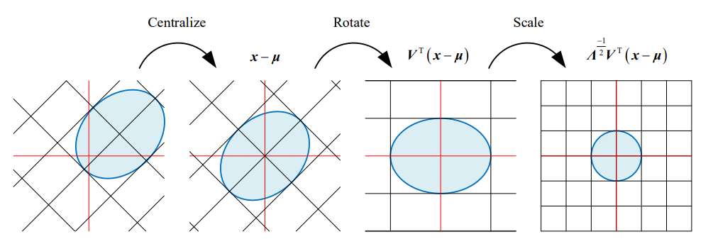
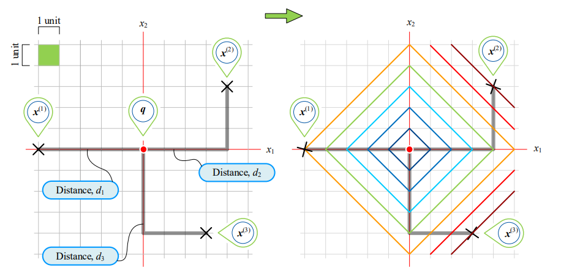
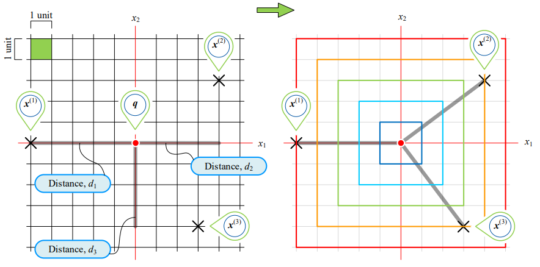
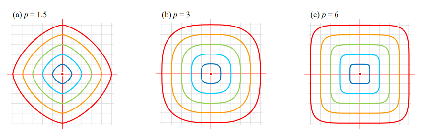

# 度量(metrics)

## 欧式距离(Euclidean distance)

欧几里得距离，也叫欧式距离，是最常见的距离。
任意样本数据点$x$和查询点$q$的欧式距离定义如下：

$$
d(x,q)=\left\| x-q \right\|=\sqrt{(x-q)^T(x-q)}
$$

## 标准化欧式距离(standardized Euclidean distance)

$$
d(x,q)=\sqrt{(x-q)^TD^{-1}D^{-1}(x-q)}
$$

其中，$D$为对角方阵，对角线元素为标准差，运算如下：

$$
D = \begin{bmatrix}
\sigma_1 & 0 & \cdots & 0 \\
0 & \sigma_2 & \cdots & 0 \\
\vdots & \vdots & \ddots & \vdots \\
0 & 0 & \cdots & \sigma_n
\end{bmatrix}
$$

这样原式可变为：

$$
d(x,q)=\sqrt{(x-q)^TD^{-1}D^{-1}(x-q)}
=\sqrt{\sum_{j=1}^D(\frac{x_j-q_j}{\sigma_j})^2}=\sqrt{\sum_{j=1}^Dz_j^2}
$$

其中，$z_j=\frac{x_j-q_j}{\sigma_j}$，类似于z分数。

## 马氏距离(Mahalanobis distance)

**[马氏距离](Mahalanobis.md)，马哈距离 (Mahalanobis distance, Mahal distance)**，全称**马哈拉诺比斯距离**。

$$
d(x,q)=\sqrt{(x-q)^T\mathit{\Sigma}^{-1}(x-q)}
$$

其中，由于：

$$
\mathit{\Sigma=V\Lambda V^{-1}}
$$

其中，由于$\mathit{\Sigma}$为对称矩阵，$\mathit{V}$为正交矩阵，故可作特征值分解:

$$
\mathit{\Sigma^{-1}=V\Lambda^{-1} V^T}
$$

代入原式有：

$$
d(x,q)=\sqrt{[\mathit{\Lambda^{-1/2}V^T(x-q)}]^T[\mathit{\Lambda^{-1/2}V^T(x-q)}]}=\left \|\mathit{\Lambda^{-1/2}V^T(x-q)}\right\|
$$

其中,$q$列向量完成中心化 (centralize),$V$矩阵完成旋转 (rotate),$Λ$矩阵完成缩放 (scale)。

## 曼哈顿距离(Manhattan distance)

即$L^1$范数，为

$$
d(x,q) = \left||x-q|\right|_1=\sum_{j=1}^D|x_j-q_j|
$$

## 切比雪夫距离(Chebyshev distance)

即$L^{\infty}$范数，为

$$
d(x,q) = \left||x-q|\right|_{\infty}=\max_j\{{|x_j-q_j|}\}
$$

## 闵氏距离(Minkowski distance)

即$L^p$范数，为

$$
d(x,q) = \left||x-q|\right|_p=\left(\sum_{j=1}^D|x_j-q_j|^p\right)^{1/p}
$$

## 余弦相似度(cosine similarity)

$$
k(x,q)=\frac{x^Tq}{\left\|x\right\|\left\|q\right\|}=cos\left\langle x,q \right \rangle
$$

## 余弦距离(cosine distance)

$$
d(x,q) = 1 - k(x,q)
$$

## 相关系数相似度 (correlation similarity)

$$
k(x,q)=\frac{(x-\bar{x})^T(q-\bar{q})}{\left\|(x-\bar{x})\right\|\left\|(q-\bar{q})\right\|}
$$