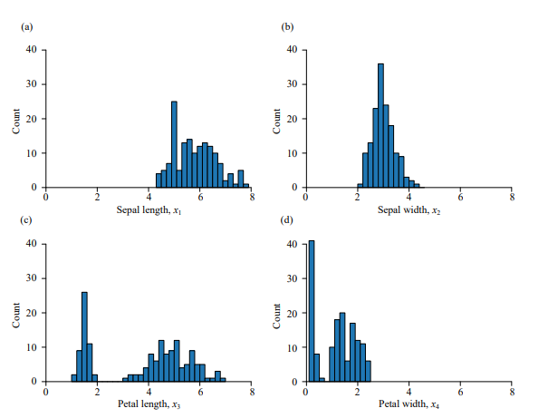
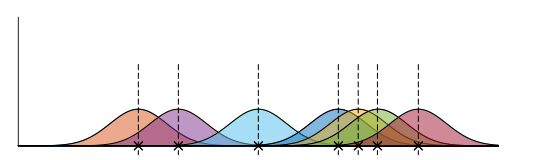

# 概率密度估计(probability density estimation)

## 直方图估计

首先将样本数据的取值范围分为一系列左右相连等宽度的**组**(bin)，然后统计每个组内样本数据的频 数。绘制直方图时，以组距为底边、以频数为高度，绘制一系列矩形图。

然而，直方图的缺点很明显，概率密度估计的结果呈现阶梯状，不平滑，不适合很多场景。

## 参数估计

参考常见的概率分布函数，以高斯分布为例，可以很容易计算得到样本数据的均值$\mu$和均方差$\sigma$，这届可用正态分布来估计数据在某个单一特征上的分布情况：

$$
\widehat{f}_X(x) = \frac{1}{\sigma\sqrt{\pi}}\exp{\left(-\frac{1}{2}(\frac{x-\mu}{\sigma})^2\right)}
$$

尽管用参数估计比直方图更加平滑，但很显然，样本不一定符合分布，并且很多细节会被忽略。

## 核密度估计(Kernel Density Estimation, KDE)

核密度实际上类似于参数估计+直方图估计的混合。
直方图不够平滑，因此我们引入合适的和函数得到更加平滑的曲线。

### 原理

任意一个数据点$x^{(i)}$，都可以用一个函数来描述，这个函数就是核函数。
如图，我们共有7个样本点，每个样本点用一个高斯核函数描述，七条曲线等权重叠加就得到核密度估计概率密度曲线。

### 公式

对于$n$个样本数据点$\{x^{(1)},x^{(2)},\cdots,x^{(n)}\}$，我们可以得到$n$个核函数：

$$
\frac{1}{h}K(\frac{x-x^{(i)}}{h}),-\infty<x<+\infty
$$

将这$n$个核函数先叠加，再平均，便得到了概率密度估计函数：

$$
\widehat{f}_X(x)=\frac{1}{n}\sum_{i=1}^nK_h(x-x^{(i)})=\frac{1}{n}\frac{1}{h}\sum_{i=1}^nK(x-x^{(i)})
$$

### 解释

##### 高斯核函数

定义：

$$
K(x)=\frac{1}{\sqrt{2\pi}}\exp{(\frac{-x^2}{2})}
$$

